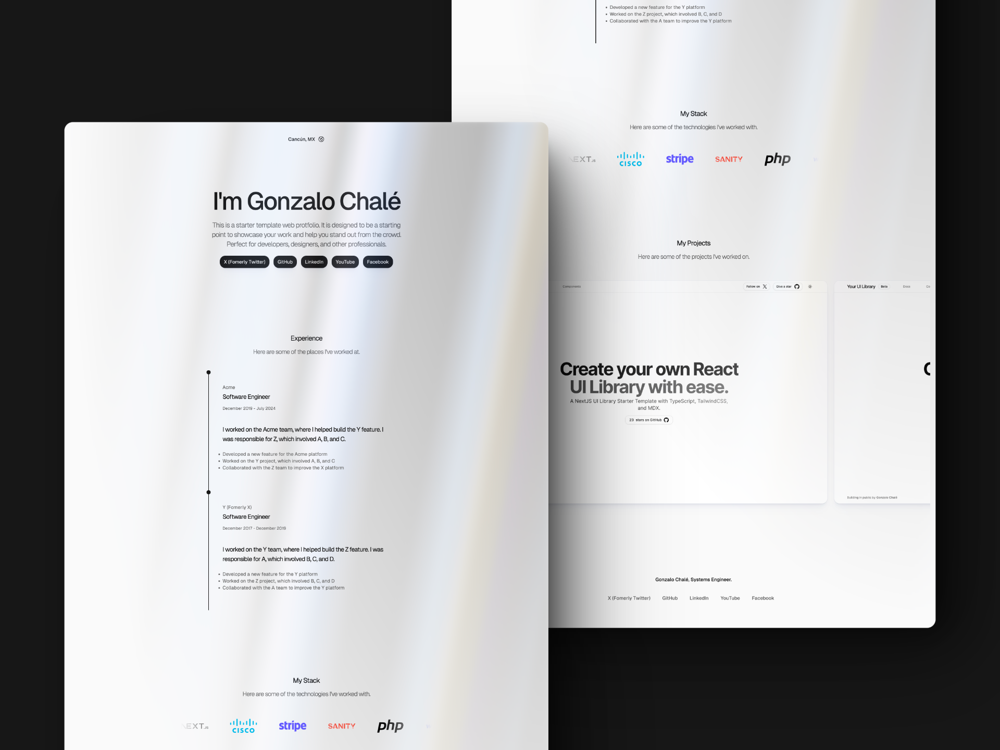

# Litefolio - Astro Portfolio Starter Template

This is a free portfolio starter template built with Astro and Tailwind CSS. The portfolio configuration is managed through a `cv.json` file.

## Live Demo

**[litefolio.vercel.app](https://litefolio.vercel.app)**

## Preview



## Deploy

Easily deploy the project with the button below. It will clone the repository to your GitHub account and create a new deployment on your Vercel dashboard.

[](https://vercel.com/new/clone?repository-url=https%3A%2F%2Fgithub.com%2Fgonzalochale%2Flitefolio)

## Installation

If you are reading this on github, you can click on the "Use this template" button above to create a new repository from astroship to your account. Then you can do a `git clone` to clone it to your local system.

Alternatively, you can clone the project directly from this repo to your local system.

### 1. Clone the repo

```bash
git clone git@github.com:gonzalochale/litefolio.git myPortfolio
# or
git clone git@github.com:gonzalochale/litefolio.git .
```

The `.` will clone it to the current directory so make sure you are inside your project folder first.

### 2. Install Dependencies

```bash
npm install
# or
yarn install
# or (recommended)
pnpm install
```

### 3. Start development Server

```bash
npm run dev
# or
yarn dev
# or (recommended)
pnpm dev
```

### Preview & Build

```bash
npm run preview
npm run build
# or
yarn preview
yarn build
# or (recommended)
pnpm preview
pnpm build
```

We recommend using [pnpm](https://pnpm.io/) to save disk space on your computer.

### Other Commands

```bash
pnpm astro ...
pnpm astro add
pnpm astro --help
```

## Project Structure

Inside of your Astro project, you'll see the following folders and files:

``` bash
/
├── public/
│   └── ...
├── src/
│   ├── components/
│   │   └── ...
│   ├── layouts/
│   │   └── ...
│   └── pages/
│       └── ...
└── cv.json <---- Portfolio Content
└── package.json
```

Astro looks for `.astro` or `.md` files in the `src/pages/` directory. Each page is exposed as a route based on its file name.

Any static assets, like images, can be placed in the `public/` directory.

## TailwindCSS

TailwindCSS is already configured in this repo, so you can start using it without any installation.

## Configuration

To customize your portfolio, edit the `cv.json` file located in the root directory. Here is an example of how the `cv.json` might look:

```json
{
  "basics": {
    "name": "Gonzalo Chalé",
    "label": "Systems Engineer",
    "image": "https://github.com/gonzalochale.png",
    "summary": "This is a starter template web portfolio. It is designed to be a starting point to showcase your work and help you stand out from the crowd. Perfect for developers, designers, and other professionals.",
    "location": {
      "city": "Cancún",
      "countryCode": "MX",
      "country": "México"
    }
  },
  "connect": {
      "sectionLabel": "Experience",
      "socials": [
        {
          "network": "X (Formerly Twitter)",
          "label": "X (Formerly Twitter)",
          "username": "gonzalochale",
          "url": "https://x.com/gonzalochale"
        },
        {
          "network": "GitHub",
          "label": "GitHub",
          "username": "gonzalochale",
          "url": "https://github.com/gonzalochale"
        },
        {
          "network": "LinkedIn",
          "label": "LinkedIn",
          "username": "gonzalochale",
          "url": "https://www.linkedin.com/in/gonzalochale/"
        },
        {
          "network": "YouTube",
          "label": "YouTube",
          "username": "chalegonzalo",
          "url": "https://www.youtube.com/@chalegonzalo"
        }
      ]
    },
  "experience": {
      "sectionLabel": "Work experience",
      "jobs": [
        {
          "company": "Acme",
          "position": "Software Engineer",
          "startDate": "2020-01-01",
          "endDate": "2024-07-31",
          "summary": "I worked on the Acme team, where I helped build the Y feature. I was responsible for Z, which involved A, B, and C.",
          "highlights": [
            "Developed a new feature for the Acme platform",
            "Worked on the Y project, which involved A, B, and C",
            "Collaborated with the Z team to improve the X platform"
          ]
        },
        {
          "company": "Y (Formerly X)",
          "position": "Software Engineer",
          "startDate": "2018-01-01",
          "endDate": "2019-12-31",
          "summary": "I worked on the Y team, where I helped build the Z feature. I was responsible for A, which involved B, C, and D.",
          "highlights": [
            "Developed a new feature for the Y platform",
            "Worked on the Z project, which involved B, C, and D",
            "Collaborated with the A team to improve the Y platform"
          ]
        }
      ]
    },
  "stack": {
    "sectionLabel": "My stack",
    "logos": [
      { "src": "/logos/astro.svg", "alt": "AstroJS Logo" },
      { "src": "/logos/astro.svg", "alt": "AstroJS Logo" },
      { "src": "/logos/astro.svg", "alt": "AstroJS Logo" },
      { "src": "/logos/astro.svg", "alt": "AstroJS Logo" },
      { "src": "/logos/astro.svg", "alt": "AstroJS Logo" },
      { "src": "/logos/astro.svg", "alt": "AstroJS Logo" },
      { "src": "/logos/astro.svg", "alt": "AstroJS Logo" },
      { "src": "/logos/astro.svg", "alt": "AstroJS Logo" },
      { "src": "/logos/astro.svg", "alt": "AstroJS Logo" },
      { "src": "/logos/astro.svg", "alt": "AstroJS Logo" }
    ]
  },
  "personalProjects": {
    "sectionLabel": "Personal projects",
    "projects": [
      {
        "name": "LiteFolio",
        "description": "This is a starter template web portfolio. It is designed to be a starting point to showcase your work and help you stand out from the crowd. Perfect for developers, designers, and other professionals.",
        "imageUrl": "/assets/project.png",
        "projectSocials": [
          {
            "network": "GitHub",
            "label": "GitHub",
            "url": "https://github.com/gonzalochale/litefolio"
          },
          {
            "network": "Demo",
            "label": "Demo",
            "url": "https://litefolio.vercel.app/"
          }
        ]
      },
      {
        "name": "LiteFolio",
        "description": "This is a starter template web portfolio. It is designed to be a starting point to showcase your work and help you stand out from the crowd. Perfect for developers, designers, and other professionals.",
        "imageUrl": "/assets/project.png",
        "projectSocials": [
          {
            "network": "GitHub",
            "label": "GitHub",
            "url": "https://github.com/gonzalochale/litefolio"
          },
          {
            "network": "Demo",
            "label": "Demo",
            "url": "https://litefolio.vercel.app/"
          }
        ]
      },
      {
        "name": "LiteFolio",
        "description": "This is a starter template web portfolio. It is designed to be a starting point to showcase your work and help you stand out from the crowd. Perfect for developers, designers, and other professionals.",
        "imageUrl": "/assets/project.png",
        "projectSocials": [
          {
            "network": "GitHub",
            "label": "GitHub",
            "url": "https://github.com/gonzalochale/litefolio"
          },
          {
            "network": "Demo",
            "label": "Demo",
            "url": "https://litefolio.vercel.app/"
          }
        ]
      }
    ]
  }
}
```

## Contributing

Contributions are welcome! Please open an issue or submit a pull request for any bugs, improvements, or new features.

## Credits

We would like to express our gratitude to the following open-source projects and their contributors:

- **SVG Icons**: Thank you to [SVGL](https://www.svgl.app) for providing the high-quality SVG icons used in this project.
- **UI Components**: We appreciate the amazing components from [AstroUI](https://astroui.vercel.app) which helped in building a seamless user interface.
- **Framework and CSS**: Special thanks to the teams behind [Astro](https://astro.build) and [Tailwind CSS](https://tailwindcss.com) for their incredible work in creating powerful tools for modern web development.

Your contributions to the open-source community are invaluable and greatly appreciated. Thank you for making this project possible!
