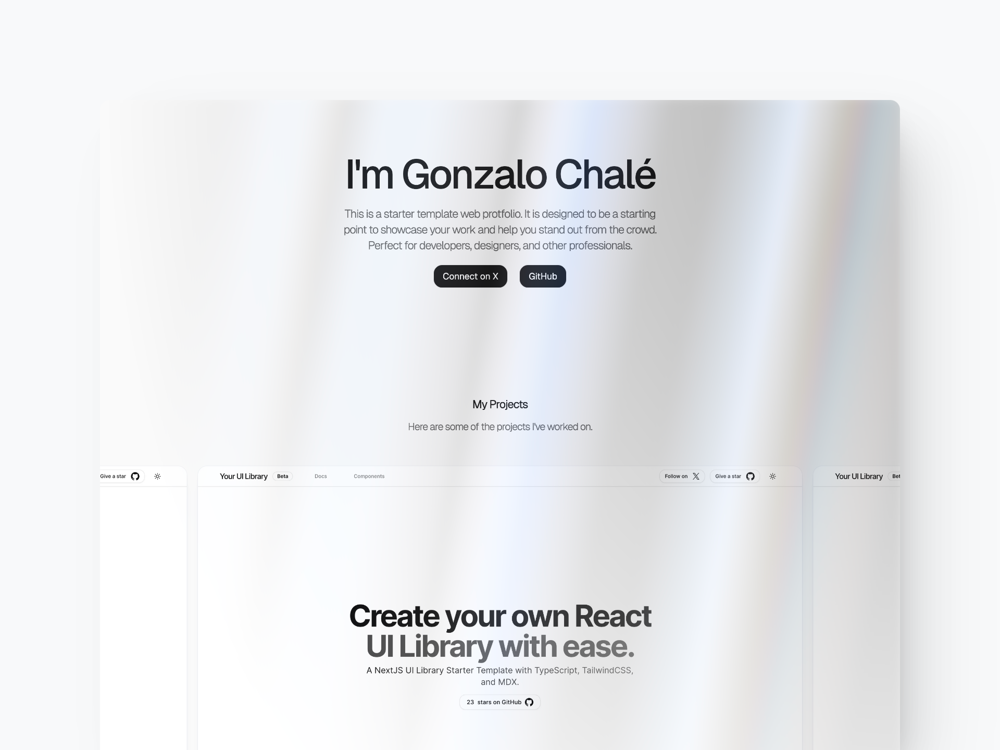

# Astro Portfolio Starter Template

This is a free portfolio starter template built with Astro and Tailwind CSS. The portfolio configuration is managed through a `cv.json` file.

## Live Demo

**[astro-portfolio-template-gonzalochale.vercel.app](astro-portfolio-template-gonzalochale.vercel.app)**

## Preview



## Installation

If you are reading this on github, you can click on the "Use this template" button above to create a new repository from astroship to your account. Then you can do a `git clone` to clone it to your local system.

Alternatively, you can clone the project directly from this repo to your local system.

### 1. Clone the repo

```bash
git clone git@github.com:gonzalochale/astro-portfolio-template.git myPortfolio
# or
git clone git@github.com:gonzalochale/astro-portfolio-template.git .
```

The `.` will clone it to the current directory so make sure you are inside your project folder first.

### 2. Install Dependencies

```bash
npm install
# or
yarn install
# or (recommended)
pnpm install
```

### 3. Start development Server

```bash
npm run dev
# or
yarn dev
# or (recommended)
pnpm dev
```

### Preview & Build

```bash
npm run preview
npm run build
# or
yarn preview
yarn build
# or (recommended)
pnpm preview
pnpm build
```

We recommend using [pnpm](https://pnpm.io/) to save disk space on your computer.

### Other Commands

```bash
pnpm astro ...
pnpm astro add
pnpm astro --help
```

## Project Structure

Inside of your Astro project, you'll see the following folders and files:

``` bash
/
├── public/
│   └── ...
├── src/
│   ├── components/
│   │   └── ...
│   ├── layouts/
│   │   └── ...
│   └── pages/
│       └── ...
└── cv.json <---- Portfolio Content
└── package.json
```

Astro looks for `.astro` or `.md` files in the `src/pages/` directory. Each page is exposed as a route based on its file name.

Any static assets, like images, can be placed in the `public/` directory.

## TailwindCSS

TailwindCSS is already configured in this repo, so you can start using it without any installation.

## Configuration

To customize your portfolio, edit the `cv.json` file located in the root directory. Here is an example of how the `cv.json` might look:

```json
{
    "basics": {
      "name": "I'm Gonzalo Chalé",
      "label": "Systems Engineer",
      "image": "https://github.com/gonzalochale.png",
      "summary": "This is a starter template web protfolio. It is designed to be a starting point to showcase your work and help you stand out from the crowd. Perfect for developers, designers, and other professionals.",
      "location": {
        "city": "Cancún",
        "countryCode": "MX",
        "country": "México"
      },
      "socials": [{
        "network": "X (Fomerly Twitter)",
        "label": "Connect on X",
        "username": "gonzalochale",
        "url": "https://x.com/gonzalochale"
      },
      {
        "network": "GitHub",
        "label": "GitHub",
        "username": "gonzalochale",
        "url": "https://github.com/gonzalochale"
      }]
    },
    "stack": [
      { "src": "/logos/next-light.svg", "alt": "Next JS WordMark" },
      { "src": "/logos/cisco.svg", "alt": "Cisco Logo" },
      { "src": "/logos/stripe.svg", "alt": "Stripe Logo" },
      { "src": "/logos/sanity.svg", "alt": "Sanity Logo" },
      { "src": "/logos/php.svg", "alt": "PHP Logo" },
      { "src": "/logos/webflow.svg", "alt": "WebFlow Logo" },
      { "src": "/logos/jquery.svg", "alt": "JQuery Logo" },
      { "src": "/logos/ngrok.svg", "alt": "NGrok Logo" }
    ],
    "projects": [{
      "name": "Create your React UI library",
      "imageUrl": "/assets/project.webp",
      "url": "https://ui-library-template.vercel.app/"
    },{
      "name": "Create your React UI library",
      "imageUrl": "/assets/project.webp",
      "url": "https://ui-library-template.vercel.app/"
    },{
      "name": "Create your React UI library",
      "imageUrl": "/assets/project.webp",
      "url": "https://ui-library-template.vercel.app/"
    }]
}
```

## Contributing

Contributions are welcome! Please open an issue or submit a pull request for any bugs, improvements, or new features.
